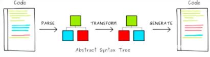

# 前言  
## Vue 3 新增了什么
- 性能（比 vue2 快了 2 倍） 真正的做到了按需更新，基于位运算
- tree shaking (按需编译代码, 真正的实现了按需加载，不像 this， this 是一个黑盒) 
- composition api (类似于 hooks)
- ts support (ts)
- custom renderer api (自定义渲染)

响应式 + 虚拟 dom + 模板编译 + 组件化

## composition api
option api: 
- 维护时，上下反复横跳
- 
composition api
基于函数组合的 api

# mini-vite 思路

编译时的优化是 Vue3 最大的特点(2017年 尤大大 在微博中就提到了 facebook 的一个库 prepack)
其中，vite 这个工具简直神奇，其主要的思路如下：
- 现在浏览器支持 es6 的import，当 script 标签中 type = module 时， 可以支持 js 中 import 语法，比如
```js
import xx from module  // 就会发起一个网络请求
```
这会发起一个网络请求，
- vite 拦截这个请求，去做相应的 vue 的编译、解析等，实现按需加载的能力
- vite 的好处就是不再打包了，而是基于浏览器支持来实现的
  dev 秒开， build 为 rollup

# 实现
直接基于 koa 搭建一个服务
实现目标：
1. 支持 npm 包的 import， 
  - import xx from 'vue' 替换成 import xx from '/@module/vue'
  ```js
  function rewriteImport(content) {
    // 目的是改造 .js 文件内容， 不是 "/", "./", or "../" 开头的 import，替换成 /@modules/ 开头
    return content.replace(/\s+from\s+['|"]([^'"]+)['|"]/g, ($0, $1) => {
      if($1[0] !== '.' && $1[0] !== '/') {
        return ` from "/@modules/${$1}"`
      }else {
        return $0
      }
    })
  }
  ```
  koa 监听到以 /@modules 开头的，就去 node_modules 里面去查找
  ```js
  if(url.startsWith('/@modules')) {
    // 这个模块，不是本地文件，而是 node_modules 连查找
    const prefix = path.resolve(__dirname, 'node_modules', url.replace("/@modules/", ""));
    const module = require(`${prefix}/package.json`).module;
    const file = fs.readFileSync(path.resolve(prefix, module), 'utf-8');
    ctx.type = "application/javascript";
    ctx.body = rewriteImport(file);
  }
  ```

2. 支持 .vue 单文件组件的解析
  - .vue 文件浏览器是不认识的 浏览器只认识 js
  - .vue 单文件组件，拆分 script template
  - template => render 函数， 拼成一个对象
  ```js
  // import xx from 'xx.vue';
    // 1. 单文件组件解析
    const p = path.resolve(__dirname, url.split('?')[0].slice(1));
    // 解析单文件组件，需要官方的库   @vue/compiler-sfc
    const { descriptor } =  compilerSfc.parse(fs.readFileSync(p, 'utf-8'));
    if(!query.type) {
      // js内容
      ctx.type = "application/javascript";
      ctx.body = `
      ${rewriteImport(descriptor.script.content.replace("export default ", 'const __script = '))};

      import { render as __render } from "${url}?type=template";
      __script.render = __render;
      export default __script;
      `
    }else if(query.type === 'template'){
      // 解析我们的 template 变成 render 函数 @vue/compiler-dom
      const template = descriptor.template;
      const render = compilerDom.compile(template.content, { mode: "module" }).code;
      ctx.type = "application/javascript";
      ctx.body = rewriteImport(render);
    }
  ```
3. 支持 import css
```js
    // 浏览器 import 仅支持 js，因此，将 css 转换成 js 即可
    const p = path.resolve(__dirname, url.slice(1));
    const file = fs.readFileSync(p, "utf-8");
    const content = `
      const css = "${file.replace(/\n/g, '')}";
      const style = document.createElement("style");
      style.innerHTML = css;
      style.setAttribute('type', 'text/css');
      document.head.appendChild(style);
      export default css;
    `;
    ctx.type = "application/javascript";
    ctx.body = content;
```
4. 热更新
- 思路是在 index.html 中注入一个 socket, 后端文件变了，通知前端去更新
5. ts 支持

# vite 原理有啥用
1. vue3 配套的工具，下一代的脚手架工具
2. 写一个 vite，完整的掌握了 vue3 代码编译的流程（使用层面）
3. ssr node 解析 .vue

编译过程
- 将 template 或者 jsx 转换成 vdom(createElement) 的形式
- 写的依然是 html， 实际执行的是 js
- template => render 函数，经典编译（vue3, 经典的编译优化）
- ast => transform => generate
;